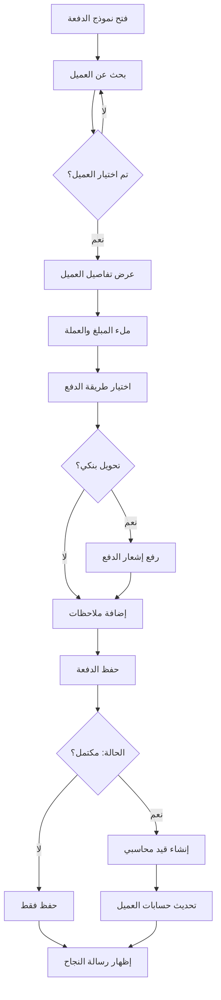

# 💰 نظام المدفوعات المتقدم - Advanced Payment System

## 📋 نظرة عامة | Overview

تم تطوير نظام متقدم لإدارة المدفوعات في نظام SaaS مع تكامل كامل مع نظام الحسابات.

---

## ✨ المميزات الجديدة | New Features

### 1. 🔍 بحث ذكي عن العملاء (Real-time Search)
- بحث فوري بالاسم أو الكود أو البريد الإلكتروني
- عرض تفصيلي لمعلومات العميل فور الاختيار
- واجهة Combobox سهلة الاستخدام

### 2. 📊 عرض تفاصيل العميل والباقة
عند اختيار العميل، يتم عرض:
- ✅ اسم الشركة (Product)
- ✅ حالة العميل (Status)
- ✅ الباقة المشترك بها (Subscription Plan)
- ✅ السعر الشهري (Monthly Price)
- ✅ تاريخ بدء وانتهاء الاشتراك

### 3. 💳 طرق دفع متعددة
- **نقدي (Cash)**: اختيار الصندوق النقدي
- **تحويل بنكي (Bank Transfer)**: 
  - اختيار الحساب البنكي
  - إدخال اسم الحساب
  - رقم المرجع
  - رفع صورة إشعار الدفع (مضغوطة)
- **بطاقة ائتمان (Credit Card)**
- **محفظة رقمية (Digital Wallet)**
- **شيك (Check)**

### 4. 📤 رفع المستندات
- رفع صورة إشعار الدفع
- ضغط تلقائي للصور
- حد أقصى 2 ميجابايت
- تخزين آمن في Supabase Storage

### 5. 🔗 تكامل مع نظام الحسابات
- إنشاء قيد محاسبي تلقائي عند استكمال الدفعة
- ربط مع شجرة الحسابات
- تسجيل في دفتر اليومية

---

## 🗂️ الملفات المحدثة | Updated Files

### Frontend
```
src/features/saas/
├── Payments.tsx                          ← صفحة المدفوعات الرئيسية
└── components/
    └── PaymentFormDialog.tsx             ← نموذج إضافة الدفعات (جديد كلياً)
```

### Backend
```
supabase/migrations/
├── STEP_57_saas_payments_infrastructure.sql  ← الهيكل الأساسي
└── STEP_57B_add_payment_columns.sql          ← الحقول الإضافية
```

---

## 📝 حقول جدول saas_payments | Payment Fields

### الحقول الأساسية | Basic Fields
```sql
id                  UUID PRIMARY KEY
payment_number      VARCHAR(50) UNIQUE      -- رقم الدفعة (تلقائي)
tenant_id           UUID                    -- العميل (إلزامي)
product_id          UUID                    -- المنتج
subscription_id     UUID                    -- الاشتراك
plan_id             UUID                    -- الباقة
amount              DECIMAL(12,2)           -- المبلغ (إلزامي)
currency            VARCHAR(3)              -- العملة (USD, SAR, EUR, etc.)
```

### طريقة الدفع | Payment Method
```sql
payment_method      VARCHAR(30)             -- طريقة الدفع
account_id          UUID                    -- الصندوق/الحساب
bank_account_id     UUID                    -- الحساب البنكي
wallet_id           UUID                    -- المحفظة الرقمية
account_name        VARCHAR(100)            -- اسم الحساب
reference_number    VARCHAR(100)            -- رقم المرجع
```

### المستندات والملاحظات | Documents & Notes
```sql
receipt_url         TEXT                    -- رابط إشعار الدفع
notes               TEXT                    -- ملاحظات
```

### الحالة والتواريخ | Status & Dates
```sql
status              VARCHAR(20)             -- الحالة (completed, pending, failed)
collection_date     TIMESTAMPTZ             -- تاريخ الاستلام
created_at          TIMESTAMPTZ
updated_at          TIMESTAMPTZ
```

---

## 🎯 كيفية الاستخدام | Usage Guide

### 1️⃣ إضافة دفعة جديدة

#### الخطوة 1: اختيار العميل (إلزامي)
```
1. اضغط على "إضافة دفعة"
2. ابحث عن العميل بالاسم أو الكود
3. اختر العميل من القائمة
4. ستظهر تفاصيل العميل والباقة تلقائياً
```

#### الخطوة 2: تفاصيل الدفعة
```
- المبلغ: يتم ملؤه تلقائياً من سعر الباقة (قابل للتعديل)
- العملة: تُملأ تلقائياً (قابلة للتعديل)
- تاريخ الاستلام: اليوم (قابل للتعديل)
```

#### الخطوة 3: طريقة الدفع
```
اختر طريقة الدفع:
- نقدي → اختر الصندوق
- تحويل بنكي → اختر البنك + أدخل رقم المرجع + ارفع الإشعار
- بطاقة ائتمان
- محفظة رقمية
- شيك
```

#### الخطوة 4: ملاحظات وحالة
```
- اختر الحالة (مكتمل، معلق، فشل)
- أضف ملاحظات إضافية
```

#### الخطوة 5: حفظ
```
- اضغط "إضافة الدفعة"
- يتم إنشاء قيد محاسبي تلقائياً (إذا كانت الحالة: مكتمل)
- يتم تحديث حسابات العميل
```

---

## 🔐 الصلاحيات | Permissions

### RLS Policies
```sql
-- القراءة: الكل
SELECT: authenticated users

-- الإضافة: المستخدمون المصرح لهم
INSERT: users with 'saas_payments_create' permission

-- التعديل: المستخدمون المصرح لهم
UPDATE: users with 'saas_payments_update' permission

-- الحذف: المدراء فقط
DELETE: users with 'saas_admin' role
```

---

## 📊 التكامل مع الحسابات | Accounting Integration

### القيد المحاسبي التلقائي
عند استكمال الدفعة (status = 'completed')، يتم:

```
من حـ/ الصندوق/البنك (Debit)       XXX
    إلى حـ/ إيرادات الاشتراكات (Credit)    XXX
```

### مثال:
```
دفعة من العميل ABC بمبلغ 1000 ريال نقداً:

من حـ/ الصندوق الرئيسي              1000
    إلى حـ/ إيرادات الاشتراكات         1000
```

---

## 🎨 واجهة المستخدم | User Interface

### مميزات الواجهة
- ✅ تصميم متدرج بـ Cards جميلة
- ✅ بحث Real-time سريع
- ✅ عرض تفاصيل العميل في بطاقة منفصلة
- ✅ أيقونات توضيحية لكل قسم
- ✅ دعم كامل للغتين (العربية والإنجليزية)
- ✅ دعم RTL للعربية
- ✅ رسائل تأكيد واضحة
- ✅ تحميل تدريجي (Loading states)

### الألوان والتصميم
```typescript
Step 1 (Customer):   Border Primary (Blue)
Step 2 (Amount):     Green accent
Step 3 (Method):     Blue accent
Step 4 (Notes):      Default
```

---

## 🔄 سير العمل | Workflow



---

## 🧪 الاختبار | Testing

### بيانات الاختبار
استخدم الملف: `test_payments_data.sql`

```sql
-- التحقق من الدفعات
SELECT * FROM saas_payments ORDER BY created_at DESC LIMIT 10;

-- التحقق من الإيرادات
SELECT get_total_revenue('USD') as total_usd;

-- التحقق من الدفعات حسب الطريقة
SELECT 
    payment_method,
    COUNT(*) as count,
    SUM(amount) as total
FROM saas_payments
WHERE status = 'completed'
GROUP BY payment_method;
```

---

## 📱 الاستجابة | Responsive Design

- ✅ Desktop: عرض كامل مع 2-3 أعمدة
- ✅ Tablet: عمودين
- ✅ Mobile: عمود واحد مع scroll

---

## 🚀 الخطوات التالية | Next Steps

### مستقبلاً
1. ⚡ إضافة دفعات متعددة (Bulk Payments)
2. 📧 إرسال إيصال تلقائي بالبريد
3. 📊 تقارير تفصيلية للمدفوعات
4. 🔔 إشعارات عند استلام دفعة
5. 💱 تحويل العملات تلقائياً
6. 📲 بوابة دفع إلكترونية
7. 🔄 دفعات متكررة تلقائية

---

## 📞 الدعم | Support

لأي استفسارات أو مشاكل:
- راجع التوثيق الكامل
- تحقق من console.log للأخطاء
- استخدم بيانات الاختبار للتأكد من الإعداد

---

## ✅ قائمة المراجعة | Checklist

- [x] نموذج إضافة الدفعات
- [x] بحث Real-time للعملاء
- [x] عرض تفاصيل العميل والباقة
- [x] طرق الدفع المتعددة
- [x] رفع إشعار الدفع
- [x] التكامل مع الحسابات
- [x] دعم اللغتين العربية والإنجليزية
- [x] دعم RTL
- [x] Responsive Design
- [x] Migration Scripts

---

**تم التحديث:** 27 يناير 2026
**الإصدار:** 1.0.0
**الحالة:** ✅ جاهز للاستخدام
